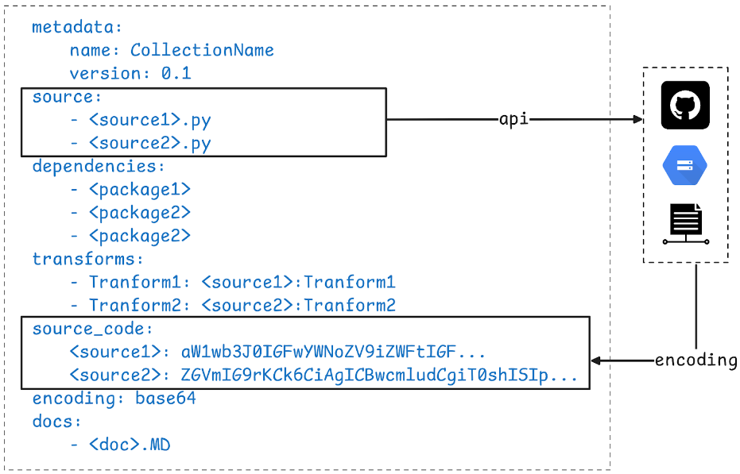
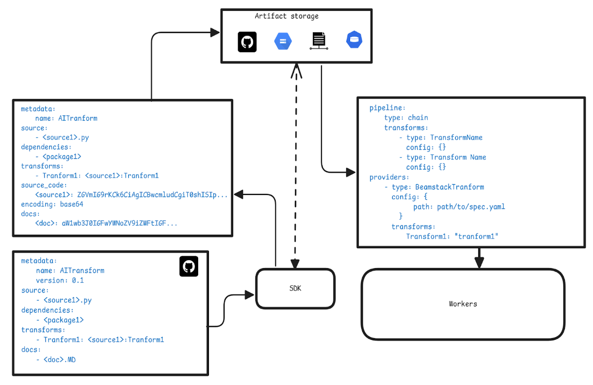

# Beamstack Transform Garden

Beamstack has a collection of custom `Transforms` specifically designed to streamline and simplify data transformations in Apache Beam workflows.

---

## Table of Contents

1. [Introduction](#introduction)
2. [Requirements](#requirements)
3. [System Overview](#system-overview)
4. [Technical Details](#technical-details)
   - [Transform System Specifications](#transform-system-specifications)
   - [Repository Layout](#repository-layout)
5. [Architecture](#architecture)  

---

## Introduction

The BeamStack Transform Garden hopes to establish a set of standards for the implementation of Apache Beam transform collections, specifically designed to support large, independent, AI-focused transforms. Its primary goal is to provide a specification for the creation and management of user-defined transform collections, and their seamless integration with Apache Beam YAML pipelines.

This framework is essential for enabling the efficient `collection`, `isolation`, and `distribution` of AI transforms, ensuring effective sharing of reusable AI transforms components across different environments and projects.  

---

## Requirements

The BeamStack Transform Garden must meet the following key requirements to ensure scalability, ease of use, and flexibility in deployment:  

  
<b>Support for Transform Distribution:</b>

  <ul>
    <li>Each transform should be packaged and distributed in a way that allows it to be shared and reused across different pipelines. The distribution mechanism should ensure that the code remains modular and version-controlled, enabling developers to quickly integrate transforms without additional setup.</li>
  </ul>

  
<b>Self-Contained Codebase:</b>

  <ul>
    <li>Each transform must be a self-contained unit with no external code dependencies beyond what is declared. This guarantees that transforms are portable, making them easier to share, update, and maintain without affecting other parts of the system.</li>
  </ul>

  
<b>Code Repository Layout Specifications:</b>

  <ul>
    <li>The project must follow a well-defined code repository structure. This includes clear guidelines for organizing the source code, documentation, and test cases of each transform. A standardized layout improves code readability, collaboration among teams, and consistency across projects.</li>
  </ul>

  
<b>Non-Dynamic Installation of Transform Dependencies:</b>

  <ul>
    <li>All dependencies required for a transform should be explicitly defined and installed ahead of time, rather than being resolved dynamically at runtime. This approach enhances stability by reducing dependency-related issues during execution and ensures that the required environment is well-prepared before the pipeline runs.</li>
  </ul>

  
<b>Transform Isolation:</b>

  <ul>
    <li>Each transform should be fully isolatable, allowing it to function independently without interference from other transforms. This isolation ensures that a transform can be modified, tested, or deployed without impacting the overall system or other transforms in the pipeline.</li>
  </ul>

  
<b>Collection of Transforms:</b>

  <ul>
    <li>The system should provide a mechanism to group multiple transforms into collections. These collections can be used for batch processing, making it easier to manage and execute several related transforms in a coordinated manner while preserving the independence of each individual transform.</li>
  </ul>

  

---

## System Overview

The method proposed for transform isolation involves using `transform specification` YAML files to fully define the characteristics of each transform. These YAML files will encapsulate all essential elements, including:    

- The `metadata information` of the transform or transform collection
- The `source files` and `source code`
- The required `dependencies`
- The `exposed transforms` available for use
- The `encoding method` of the source code, typically Base64  

In order to support this, the `Beam SDK` will require the implementation of a custom `ExternalProvider` class, which we’ll refer to as the `BeamStack ExternalProvider`. This provider, in addition to handling the basic functionalities of an external provider, will be responsible for the following:  

  
<b>Installation of Transform Dependencies:</b>

  <ul>
    <li>The provider will handle the installation of all required dependencies prior to execution, avoiding the current BeamStack approach of resolving dependencies dynamically at runtime. This ensures that transforms are stable and predictable, with all dependencies installed beforehand.</li>
  </ul>

  
<b>Decoding Source Code:</b>

  <ul>
    <li>Since the source code in the transform specification will be Base64-encoded, the BeamStack ExternalProvider will be responsible for decoding the source code before it can be used in the pipeline.</li>
  </ul>

---

## Technical Details

### **Transform System Specifications**  
`sample.yaml`

The transform specification file contains the following elements:  

**Metadata**:  
This section includes key information about the transform, such as the name and version of the current transform.

**Source**:  
This is the reference to the source Python file for the transform. The source file can be hosted in various locations such as a GitHub repository, a cloud storage bucket, or a local file system. The path provided should be:

- The `absolute path` of the file if it resides outside the directory containing the YAML file.
- The `remote path` if stored in cloud storage (e.g., `gs://example-bucket/transform.py`).
- The `filename` if the source file is in the same directory as the YAML file in the local file system or in a github repository

**Transforms**:  
These are the transforms defined in the source files. Transforms specified here must be limited to those developed within the source files, without incorporating external or internal (Beam) transforms. Multiple source files can be added to form a `collection of transforms`, which is especially useful when the transforms share similar dependencies.  
  
**Source Code**:  
This is the Base64-encoded content of the source files specified in the 'Source' section. It ensures that the source code can be easily decoded and executed in environments where direct file access is not available.

**Docs**:  
This contains any documentation for the transforms/collection. This should be in the same directory as the specification file.

### Repository Layout  
While there are minimal restrictions on the directory structure of a GitHub repository intended for use as a transform garden, the following guidelines should be followed:

  
<b>Individual Transform Directories:</b>

  <ul>
    <li>Each transform should be stored in its own separate directory to maintain clarity and organization.</li>
  </ul>

  
<b>Transform Collection Directory:</b>

  <ul>
    <li>A transform collection should be organized in a directory that contains subdirectories for each transform within that collection.</li>
  </ul>

  
<b>Transform Specification YAML Files:</b>

  <ul>
    <li>A transform specification YAML file must be created for every transform collection, located within the corresponding collection directory.</li>
    <li>Additionally, each transform that is not part of a collection should have its own specification YAML file.</li>
  </ul>

  
<b>Transform Packaging:</b>

  <ul>
    <li>A transform can be packaged as part of a collection or as a standalone unit, or both. If a transform is included in a collection but also needs to be isolated, it should have its own transform specification file.</li>
  </ul>

  
<b>Source File Location:</b>

  <ul>
    <li>The source files for a transform should be located in the same directory as its associated specification file to ensure easy access and reference.</li>
  </ul>

  
<b>Documentation:</b>

  <ul>
    <li>Documentation should be provided in Markdown (.md) or plain text (.txt) format and should reside in the same directory as the transform specification file.</li>
  </ul>

  
<b>Licensing Information:</b>

  <ul>
    <li>Licensing information must be placed in the root directory of the repository. The license applies to all transforms specified within that repository.</li>
  </ul>

---

## Architecture

